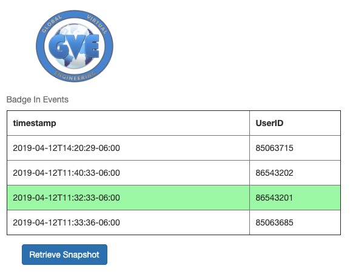
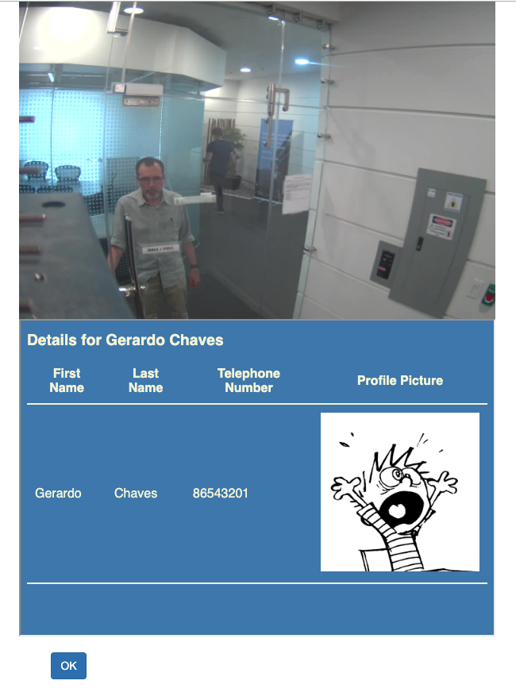

# Meraki Camera Badge Reader Sync Sample

This sample Flask application demonstrates how you could associate badge scanner event information
with Meraki [Snapshot Network Camera API](https://developer.cisco.com/meraki/api/#/rest/api-endpoints/cameras/snapshot-network-camera) to allow a user to look back in time to particular timestamps and pull up
the corresponding snapshot from the camera and alongside display a directory entry to help
the operator validate that the person using the badge to enter a location is the one
that appears in their direcotory photo. 

The sample badge reader events used in this example are contained in a List variable where 
each element is a Dict with a timestamp and UserID for the ownder of the badge which we assume
a badge entry solution can provide us.

The data is defined as such in the app.py code file:

```
sampleBadgeReaderEvents=[{'timestamp': "2019-04-12T14:20:29-06:00", 'UserID': "85063715"},
                         {'timestamp': "2019-04-12T11:40:33-06:00", 'UserID': "86543202"},
                         {'timestamp': "2019-04-12T11:32:33-06:00", 'UserID': "86543201"},
                         {'timestamp': "2019-04-12T11:33:36-06:00",'UserID': "85063685"}]
```

This sample uses a publicly available example directory application we built and are hosting in Heroku
at http://sparkky.herokuapp.com. We are not documenting it's full usage since it is really
meant as a placeholder for you to put in your own web based directory. You can put your own directory address in the 
**screenshot.html** file in the templates directory. 

### Requirements

This sample depends on the following Python libraries:

```
Flask 
render_template
request
jsonify
make_response
flask_httpauth
flask_bcrypt
simplepam
time
requests
json
```

It also requires a **config.py** file in the same directory as the **app.py** file  with
the following as it's content:

```
secret_key = 'SOME-KEY'
meraki_key = 'THE-MERAKIAPI-KEY'
meraki_network = 'MERAKI-NETWORK-ID'
camera_serial = 'CAMERA-SERIAL'
```

### Running the sample

Once you have entered the correct Meraki API key, Meraki Network ID and camera serial in the newly created **config.py** file, you should
be able to start the Flash application by running the app.py script:

```
python3 app.py
```

Then open a browser and point to localhost port 5000 (https://0.0.0.0:5000)
You will first be prompted to authenticate using user credentials for a user on the system from where you are
executing the script. Once you get past authentication, you will see the main screen as show below and, after selecting an
entry and clicking on the Retrieve Snapshot button, the snapshot page should be shown as depicted further below.

### Screenshots

Main page with badge entre selection:


Result after retrieving snapshot:
